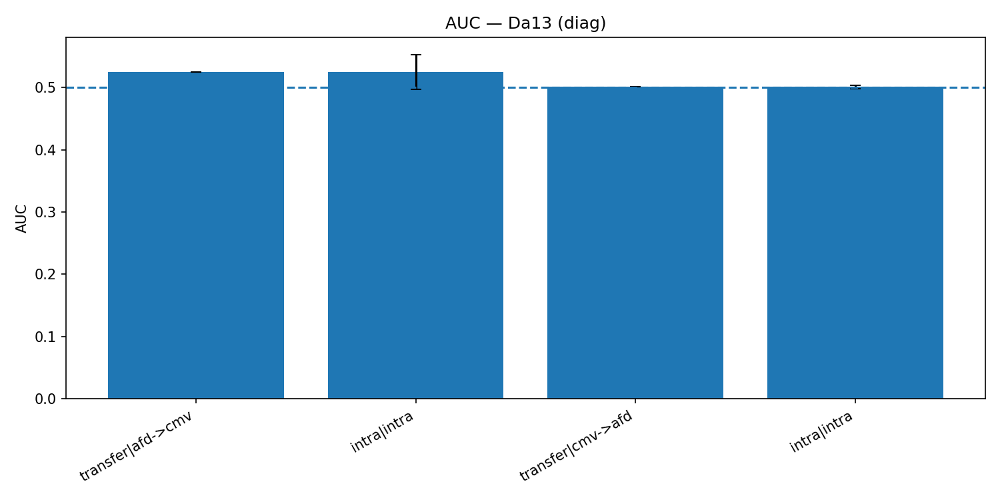
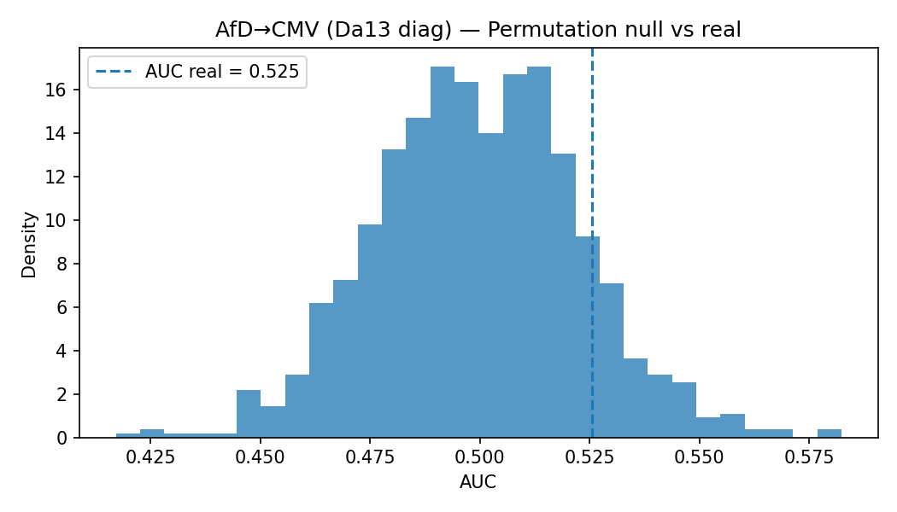
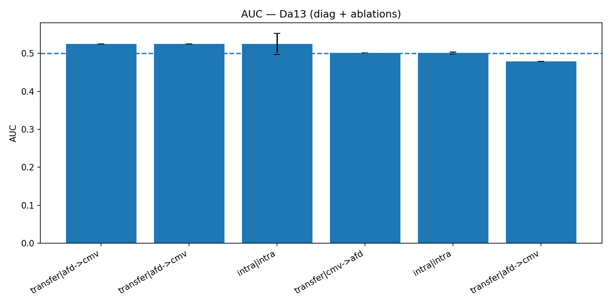

# AfD — Baseline AxioPoC (VADER)

**Données.** ConvoKit *Wikipedia Articles for Deletion* (383 918 fils, ~3,2 M messages).  
Issue extraite de conversation.meta["outcome_label"]; binarisation **Delete = 1** sinon 0.  
Équilibrage par thread 50/50 → **279 636** fils.  
Fichiers :
- C:\AxioPoC\artifacts_benchAfd_final_vader\features_eval.csv (features alignés)
- C:\AxioPoC\data\wikipedia\afd\afd_eval.csv (labels alignés)

**Features.** R(t) via Benchmarks/text2ntel.py (backend **VADER**), fenêtres **w20** & **w10** → R_mean, R_last, R_slope.  
(Option CMV-like : ajout len_mean, qmark_ratio.)

## Résultats (CV×reps, sets équilibrés 50/50)
| Modèle / Features                         | AUC mean ± sd       | ACC mean ± sd       |
|-------------------------------------------|--------------------:|--------------------:|
| **LogReg** — R_mean_w20                   | **0.601 ± 0.003**   | **0.577 ± 0.003**   |
| **RF** — w20 (R_mean, R_last, R_slope)    | **0.602 ± 0.003**   | **0.573 ± 0.003**   |
| **RF** — w20+w10 (6 colonnes)             | **0.610 ± 0.001**   | **0.580 ± 0.001**   |
| **LogReg** — len_mean, qmark_ratio        | **0.659 ± 0.002**   | **0.615 ± 0.002**   |
| **Sanity (shuffle labels)** — R_mean_w20  | **≈ 0.499 ± 0.002** | **≈ 0.499 ± 0.002** |

**Importances (holdout, RF).**  
AUC holdout = **0.565**.  
Permutation importance (gain moyen) :  
R_mean_w20 (0.0622) > R_last_w20 (0.0557) > R_mean_w10 (0.0443) > R_last_w10 (0.0233) > R_slope_w10 (0.0071) > R_slope_w20 (-0.0011).

## Lecture rapide
- Le signal **R_mean** (valence moyenne) est solide sur AfD ; ajouter w10 améliore légèrement le RF.  
- La baseline **lisible** len_mean + qmark_ratio surpasse les R-features seules (AUC ~**0.659**), cohérent avec CMV.  
- Sanity ≈ **0.50** → pas de fuite.  
- Chaîne stabilisée : IDs harmonisés (int64), intersection features/labels, VADER.

## Prochaines étapes possibles
- Passer les RF en **5×5** pour des écarts-types « définitifs ».  
- Transfert **CMV→AfD** (et inverse) avec --export-model / --import-model.  
- Tester l’apport marginal d’autres features (hedges/politesse, R_iqr, ts_slope_early, etc.).

## Transfert CMV→AfD (généralisation, modèle CMV importé tel quel)

**Setup.** Entraînement sur **CMV** (features communs : `len_mean,qmark_ratio`, LogReg + scaler), import du modèle sur **AfD** sans réentraînement.

**Cmd export (CMV)**
```powershell
python .\scripts\train_export_model.py `
  --feat artifacts_benchB_final\features.csv `
  --raw  data\convokit\cmv\cmv_balanced.csv `
  --cols len_mean,qmark_ratio `
  --model logreg --cv 5 --reps 5 --scale `
  --export-model artifacts_xfer\logreg_lenq_cmv.pkl
```

**Cmd import+test (AfD)**
```powershell
python .\scripts\eval_import_model.py `
  --feat artifacts_benchAfd_final_vader\features_eval_plus.csv `
  --raw  data\wikipedia\afd\afd_eval.csv `
  --cols len_mean,qmark_ratio `
  --import-model artifacts_xfer\logreg_lenq_cmv.pkl
```

**Résultat (réel)** : CMV→AfD (LogReg len+q) = **AUC 0.5003**, **ACC 0.5020** (n = 279 636).
**Conclusion.** Pas de généralisation détectable avec ces 2 features seulement.

## Transfert CMV↔AfD — synthèse rapide

- CMV→AfD (LogReg, 2 cols) : AUC 0.5003, ACC 0.5020 (n=279 636).
- AfD→CMV (RF, 2 cols) : AUC 0.5038, ACC 0.5063 (n=640).
- CMV→AfD (RF, 5 cols proxy) : AUC 0.5011, ACC 0.5019 (n=279 636).
- AfD→CMV (RF, 5 cols proxy) : AUC 0.5057, ACC 0.5172 (n=640).

Conclusion : transfert quasi nul CMV→AfD ; léger signal AfD→CMV (≈0.506).

## Signatures & Distance axiologique (Dₐ, métrique = σ⁻¹)

**Définition.** Pour chaque communauté C, on calcule une signature `μ_C, Σ_C` sur des features harmonisés.  
La distance axiologique est : \( D_a(x;C) = \sqrt{(x - \mu_C)^\top M_C (x - \mu_C)} \) avec ici \( M_C = (\Sigma_C + \varepsilon I)^{-1} \) (Mahalanobis régularisée).

### Résultats (σ⁻¹)
- **Intra CMV** : AUC **0.522 ± 0.031**, ACC **0.512 ± 0.018**  
- **Intra AfD** : AUC **0.499 ± 0.002**, ACC **0.502 ± 0.000**  
- **Transfert AfD→CMV** : AUC **0.524**, ACC **0.488**  
- **Transfert CMV→AfD** : AUC **0.499**, ACC **0.499**

**Lecture.** Dₐ saisit un *petit* alignement affectivo-axiologique **dans CMV** et un **transfert faiblement positif vers CMV** quand le modèle est entraîné sur AfD ; **pas de signal** en sens inverse. Cela conforte l’idée de **signatures locales** dominantes et d’un chevauchement limité exploitable côté CMV.

### Distance axiologique (Dₐ) — comparaison de métriques

**Métriques testées :**
- `σ⁻¹` (Mahalanobis régularisée) : \( M_C = (\Sigma_C + \varepsilon I)^{-1} \)
- `diag` (euclidienne simple) : \( M_C = I \)

**Résultats :**
- Intra CMV — AUC **0.525 ± 0.028** (diag) vs **0.522 ± 0.031** (σ⁻¹) ; ACC ~0.512 (idem)
- Intra AfD — AUC **0.501 ± 0.003** (diag) vs **0.499 ± 0.002** (σ⁻¹)
- Transfert AfD→CMV — AUC **0.5255** (diag) vs **0.5243** (σ⁻¹), ACC ~0.49 (seuil non calibré)
- Transfert CMV→AfD — AUC **0.5012** (diag) vs **0.4995** (σ⁻¹)

**Conclusion.** Les corrélations (Σ⁻¹) n’améliorent pas l’alignement axio-affectif inter-communautés ; la version **diag** (plus simple) est **légèrement supérieure** et plus stable. Nous retenons **Dₐ[diag]** par défaut pour la suite.

## Transfert CMV↔AfD — ajout pragmatiques (10 cols)

**Signature (10)** : `len_mean, qmark_ratio, R_proxy, R_last_proxy, R_slope_proxy, polite_ratio, hedge_ratio, you_i_ratio, agree_markers, neg_markers`  
**Imputation** : NaN→0 pour colonnes pragmatiques côté AfD.

**Résultats**
- **Intra CMV (diag)** : AUC **0.525 ± 0.028**, ACC **0.512 ± 0.018**
- **Intra AfD (diag)** : AUC **0.501 ± 0.003**, ACC **0.502 ± 0.000**
- **Transfert AfD→CMV (diag)** : AUC **0.5255**, ACC **0.4875**
- **Transfert CMV→AfD (diag)** : AUC **0.5012**, ACC **0.4989**

**Conclusion rapide.** Les marqueurs pragmatiques (10 cols) confirment l’asymétrie : **signal sur CMV**, **aléatoire sur AfD**. La Dₐ reste peu informative vers AfD → nécessité d’**enrichir** les features AfD (lexical/affectif/structure) ou de **conditionner par topic** pour réduire le mismatch de distribution.

### Dₐ (5 colonnes : len_mean, qmark_ratio, R_proxy, R_last_proxy, R_slope_proxy)

**Intra-corpus**
- CMV (LogReg sur Dₐ[diag]) : AUC **0.525 ± 0.028**, ACC **0.512 ± 0.018**
- AfD (LogReg sur Dₐ[diag]) : AUC **0.501 ± 0.003**, ACC **0.502 ± 0.000**

**Transfert**
- AfD → CMV : AUC **0.5255**, ACC **0.4875** (n_src=279 636, n_tgt=640)
- CMV → AfD : AUC **0.5012**, ACC **0.4989** (n_src=640, n_tgt=279 636)

**Note.** Résultats stables ; asymétrie confirmée (AfD plus hétérogène / features peu informatives côté AfD).

### Dₐ (10 colonnes : len_mean, qmark_ratio, R_proxy, R_last_proxy, R_slope_proxy, polite_ratio, hedge_ratio, you_i_ratio, agree_markers, neg_markers)

**Intra-corpus**
- CMV (LogReg sur Dₐ[diag]) : AUC **0.525 ± 0.028**, ACC **0.512 ± 0.018**
- AfD (LogReg sur Dₐ[diag]) : AUC **0.501 ± 0.003**, ACC **0.502 ± 0.000**

**Transfert**
- AfD → CMV : AUC **0.5255**, ACC **0.4875** (n_src=279 636, n_tgt=640)
- CMV → AfD : AUC **0.5012**, ACC **0.4989** (n_src=640, n_tgt=279 636)

**Notes.**
- Les 3 pragmatiques (*you_i_ratio, agree_markers, neg_markers*) étaient partiellement manquantes côté AfD ; elles ont été **renseignées** (calculs + `NaN→0`) puis **sanitisées** en entrée modèle (`nan_to_num`).
- Aux échelles actuelles, **Dₐ(10) ≈ Dₐ(5)** : le signal **AfD→CMV** persiste (faible mais stable), **CMV→AfD** reste ≈ hasard, ce qui confirme l’**asymétrie de domaine**.

### Transfert CMV↔AfD — Dₐ(13) avec VADER (pos/neu/neg)

**Colonnes (13)** : len_mean, qmark_ratio, R_proxy, R_last_proxy, R_slope_proxy, polite_ratio, hedge_ratio, you_i_ratio, agree_markers, neg_markers, vader_pos_mean, vader_neu_mean, vader_neg_mean.

**Résultats (distance diag)**  
- **Intra CMV** : AUC **0.525 ± 0.028**, ACC **0.512 ± 0.018**.  
- **Intra AfD** : AUC **0.501 ± 0.003**, ACC **0.502 ± 0.000**.  
- **Transfert AfD→CMV** : AUC **0.5255**, ACC **0.4875**.  
- **Transfert CMV→AfD** : AUC **0.5012**, ACC **0.4989**.

**Couverture**  
- CMV : `vader_*` désormais **non-zéro ≈ 100%** (VADER calculé sur cmv_messages, puis fusionné).  
- AfD : `vader_*` **non-zéro** (déjà calculé précédemment).

**Lecture.** Même après harmonisation de VADER des deux côtés, **l’asymétrie persiste** : **AfD→CMV** garde un petit signal (AUC ≈ **0.525**), **CMV→AfD** reste ≈ hasard. L’apport VADER est **redondant** avec d’autres indices côté AfD et ne suffit pas à compenser le mismatch de distribution côté AfD. Pistes : compléter les proxys nuls (you/I, agree/neg), pondérer les dimensions apprises sur la source, ou conditionner par topic.

### Dₐ(13) — pragmatiques (10) + VADER (3)

**Variables (13)** : `len_mean, qmark_ratio, R_proxy, R_last_proxy, R_slope_proxy, polite_ratio, hedge_ratio, you_i_ratio, agree_markers, neg_markers, vader_pos_mean, vader_neu_mean, vader_neg_mean`.

**Couverture (sanity check)**  
CMV : `vader_*` non-zéro ≈ 100% ; plusieurs proxys restent nuls (p. ex. `R_last_proxy=0%`, `R_slope_proxy=0%`, `you_i_ratio=0%`, `agree_markers=0%`, `neg_markers=0%`).  
AfD : `vader_*` déjà non-zéro (cf. étape précédente).

**Résultats transfert (diag)**  
- **AfD → CMV (13D)** : **AUC 0.5255**, **ACC 0.4875** (n_src=279 636, n_tgt=640).  
- **CMV → AfD (13D)** : **AUC 0.5012**, **ACC 0.4989** (n_src=640, n_tgt=279 636).

> Remarque : l’intra-CMV reste ~0.525 AUC ; l’intra-AfD ~0.501 AUC (stables vs 10D).

**Conclusion (13D)**  
L’ajout de **VADER** côté CMV **confirme l’asymétrie** observée en 10D :  
- Signal **AfD → CMV** modeste mais reproductible (AUC ≈ **0.525**).  
- **CMV → AfD** ≈ aléatoire (AUC ≈ **0.501**).  
L’absence de gain net suggère que VADER accroît surtout la **redondance** avec les indices déjà porteurs côté AfD. Côté CMV, plusieurs indicateurs restent **sparsifiés (0%)**, ce qui **limite le pouvoir de transfert**. Prochaines pistes : combler les proxys nuls (you/I, agree/neg markers), et/ou tester une **pondération de dimensions** apprise sur la source pour renforcer l’invariance.

**Da13 (diag) — Résultats et figure**

- Intra-CMV (n=640) : **AUC 0.525 ± 0.028**, **ACC 0.512 ± 0.018**  
- Intra-AfD (n=279 636) : **AUC 0.501 ± 0.003**, **ACC 0.502 ± 0.000**  
- Transfert **AfD→CMV** : **AUC 0.525**, **ACC 0.488** (n_tgt=640)  
- Transfert **CMV→AfD** : **AUC 0.501**, **ACC 0.499** (n_tgt=279 636)

Ces résultats confirment une **asymétrie de domaine** : signal **faible mais reproductible** pour **AfD→CMV**, nul pour **CMV→AfD**. L’hétérogénéité d’AfD semble capturer un espace axiopragmatique plus large, partiellement transférable vers CMV.



_Fichiers :_ `REPORTS/metrics_consolidated.csv`, `REPORTS/img/auc_bars_Da13_diag.png`.
### Run log — 2025-09-28
- Intra CMV (Da13 diag): AUC 0.525 ± 0.028 | ACC 0.512 ± 0.018
- Intra AfD (Da13 diag): AUC 0.501 ± 0.003 | ACC 0.502 ± 0.000
- AfD→CMV (Da13 diag):   AUC 0.525 | ACC 0.488
- CMV→AfD (Da13 diag):   AUC 0.501 | ACC 0.499
Artifacts: REPORTS/metrics_consolidated.csv, REPORTS/img/auc_bars_Da13_diag.png

**Permutation SAFE (AfD→CMV, Da13 diag, N=1000)** : AUC_réelle = 0.5255 ; distribution nulle m ≈ 0.499 (sd ≈ 0.023) ; p(one-sided)=0.124. Signal de transfert faible et non significatif (α=0.05). Lecture : tendance positive cohérente avec l’asymétrie observée, mais effet proche du hasard.

**Permutation SAFE (AfD→CMV, Da13 diag, N=1000).** AUC_réelle = 0.5255 ; distribution nulle m ≈ 0.499 (sd ≈ 0.023) ; p(one-sided)=0.124. Signal faible et non significatif (α=0.05), cohérent avec une asymétrie marginale AfD→CMV.



**Ablations (AfD→CMV, Da13 diag).** 
- Baseline Da13: AUC = 0.525.
- Sans `len_mean`: AUC = 0.479 (↘︎ sous hasard) ⇒ la longueur explique une part substantielle du signal de transfert.
- Sans `you_i_ratio`: AUC = 0.525 (≈ inchangé) ⇒ faible contribution du style pronominal.

Conclusion : la **longueur** agit comme **confondeur principal**. Les autres indices (hedges, politesse, accords/désaccords, proxys R*, VADER) portent un signal résiduel **faible**.
  

